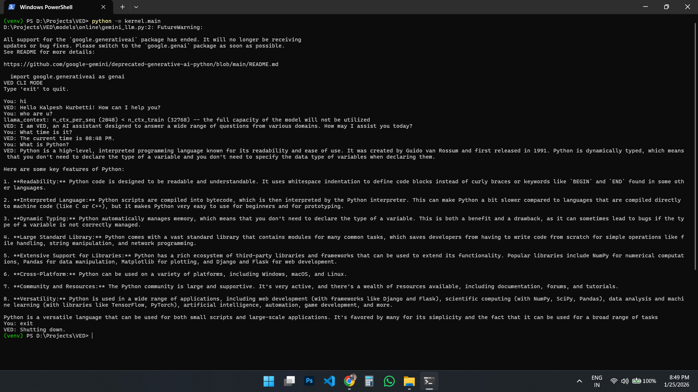
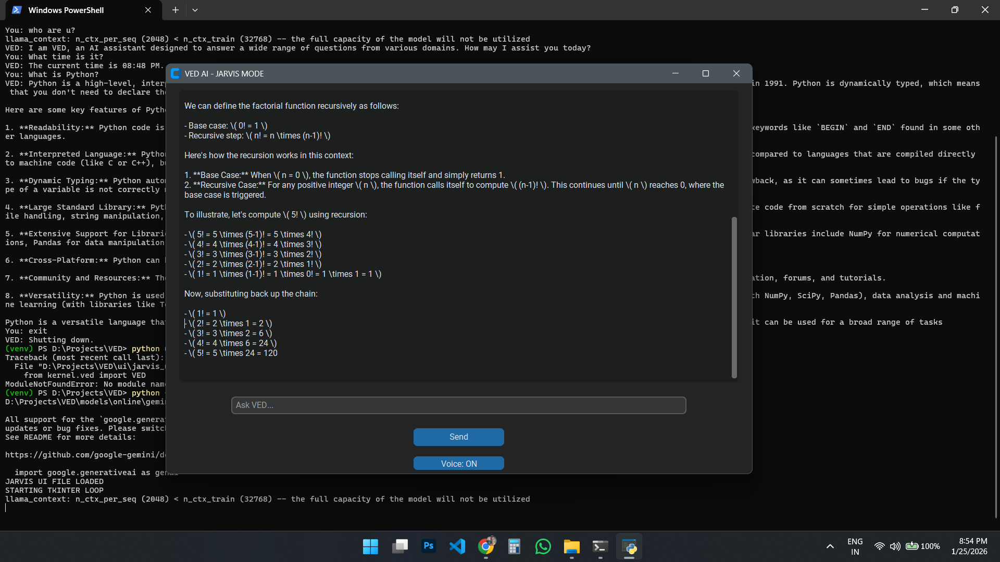

# VED – Hybrid Offline AI Assistant (v1.0)

VED is a production-ready, offline-first AI assistant with optional online intelligence.
It is designed to never fail: if online APIs are unavailable, VED seamlessly falls back to a local LLM.

## 📸 Demo Screenshots

### CLI Mode


### GUI Mode (Jarvis UI)


## Features
- Offline-first (Qwen local LLM)
- Hybrid online support (OpenAI, Gemini)
- Smart fallback & cooldown handling
- Tool-based reasoning (time, math, system)
- CLI interface (GUI-ready)
- Modular architecture

## System Requirements
- Python 3.10+
- 8 GB RAM (minimum)
- Windows 10/11
- Internet optional

## How to Run

```bash
python -m kernel.main
